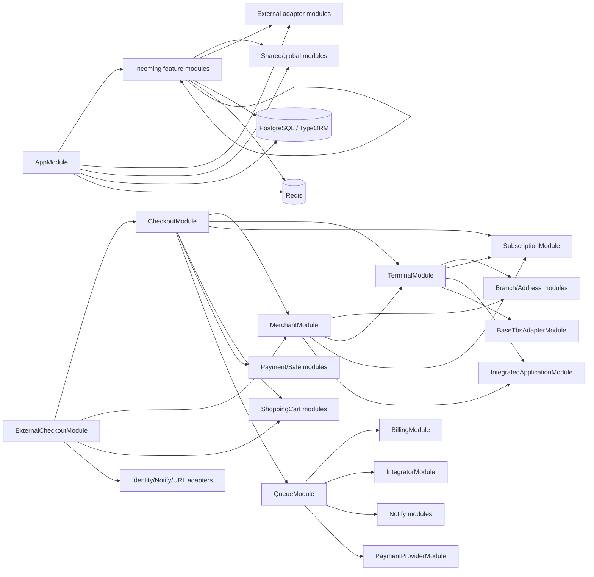

# Token X Onboarding Service Architecture Guide

This document records the architecture observed in this repository on 2026-09-04. It is intended as a factual reference for restructuring another NestJS service, not as an endorsement of every pattern present here.

Evidence labels used throughout:

- **Observed** — directly verified in repository code or configuration.
- **Inferred** — a strong conclusion from repeated code structure or dependency direction.
- **Recommended** — guidance for adopting or improving the pattern elsewhere; it is not a claim about current behavior.

Generated output (`dist/`, `test_reports/`) and installed dependencies (`node_modules/`) were examined only where needed to understand runtime behavior. They are not treated as authored source structure. Local working-tree changes that predated this guide were not modified.

# 1. Executive Summary

**Observed.** This is a single deployable NestJS 10 service containing 53 Nest modules, 52 feature controller files plus the root controller, 63 service files, 60 repository-named files, and 236 DTO files under `src/`. Its domain covers merchant onboarding, branches and addresses, terminals, carts, checkout, billing, subscriptions, integrators, and solution partners. PostgreSQL/TypeORM is the system of record; Redis supports carts, mock TBS data, and BullMQ; integrations include identity, Keycloak administration, notifications, payment, SAP, TBS, URL shortening, IBM Cloud Object Storage, and application/integrator webhooks.

**Inferred architectural classification.** The service is a **feature-modular monolith with pragmatic layers and shared infrastructure**, or a layered/modular hybrid. It is not clean architecture or hexagonal architecture in the strict sense:

- Presentation is represented by audience- and version-specific controllers.
- Application logic and substantial domain policy are combined in feature `*.service.ts` classes.
- Persistence is separated into concrete repository classes, but services inject concrete implementations rather than ports.
- ORM entities and many domain contracts come from organization packages, especially `@token-org/token-util` and `@token-org/token-x-appstore-shared-kit`.
- Infrastructure adapters are usually under `src/modules/external`, but TBS base behavior is under `src/modules/shared`, Redis repositories live inside features, and webhook HTTP calls occur inside incoming/application services.
- Cross-feature services import one another extensively. No module-level import cycle was found by static inspection, but several hub modules have broad dependency surfaces.

The dominant request path is:

```text
HTTP request
  -> URI version routing
  -> audience authorization interceptor (header validation + CLS context)
  -> global/custom DTO validation
  -> optional request-scoped TypeORM transaction
  -> controller
  -> feature service/orchestrator
  -> concrete repository, another feature service, Redis, queue, or external adapter
  -> optional DTO serialization
  -> global success envelope
  -> HTTP response

Any thrown error
  -> global error logger
  -> global exception filter
  -> standard failure envelope
```

The strongest reusable ideas are feature modules, audience/version controller separation, globally strict input validation, explicit output DTO serialization, centralized exception creation, request-context propagation through CLS, a repository boundary around TypeORM, adapter modules for external APIs, and integration tests organized around API contracts.

The most important patterns **not** to copy unchanged are:

- inbound “authorization” trusts identity headers and only validates their shape; it does not authenticate tokens, verify signatures, check roles, or prove resource ownership;
- two `/admin/.../operation-retries/:id` controllers and the subscription-renewal `/internal-service/...` controller have no active authorization decorator;
- large orchestration services and repositories have grown to 400–1,000 lines;
- modules sometimes re-provide another module's service/repository instead of importing its public API;
- response serialization is opt-in and covers only 93 of 168 route handlers;
- configuration is split between manual `dotenv`, a static `ENV_VAR` object, and Nest `ConfigModule`, without a typed schema;
- queues have retries but no configured dead-letter strategy, and producer methods commonly swallow enqueue failures after logging;
- TypeScript strictness is mostly disabled, and the test pipeline initially suppresses test failure with `|| true` before a retry stage.

## Reusable pattern assessment

| Pattern | Where and how | Why it appears used | Mandatory convention here | Optional/domain-specific | Risk or limitation | Safe adoption elsewhere |
|---|---|---|---|---|---|---|
| Feature modules | `src/modules/incoming/*/*.module.ts`; controller/service/repository/DTOs grouped by capability | Keeps related API and business code together | A provider must be declared/exported and its module imported before cross-module injection | Which domains and subfolders exist | Hub modules become highly coupled | Define a small public module API; test the module graph for cycles |
| Audience/version controllers | `controllers/v1|v2/{me,admin,public,device,...}.controller.ts` | Separates caller-specific contracts while reusing services | Controller `version` must match URI versioning | Audience names and paths | Duplicate endpoints and divergent policies | Keep path/version/audience metadata consistent and share only application use cases |
| Strict global validation | `src/app.module.ts`, `CustomValidationPipe` | Rejects unknown data and transforms DTOs | `whitelist`, `forbidNonWhitelisted`, `transform`, and DTO decorators are required for intended behavior | Localized client messages and transforms | Decorator order/message mapping is fragile; untyped scalar params can escape validation | Use a single global pipe, typed DTOs for all inputs, and tests for nested/query/scalar cases |
| CLS request identity | `ClsModule` + `AuthorizationService` + `ClsAdapterService` | Avoids passing actor IDs through every method | CLS middleware must mount before interceptors; getters must be request-bound | Which identity fields are stored | Hidden dependencies and missing context in jobs/events | Wrap CLS in an interface; explicitly construct context for non-HTTP work |
| Request-bound transactions | `DatabaseTransactionInterceptor` + request-scoped `BaseRepository` descendants | Lets multiple repositories share one TypeORM `EntityManager` | Mutating endpoint must opt into interceptor; repository must use `this.repository` | Which operations are transactional | Easy to omit; `transactionFreeRepository` bypasses atomicity; request scope adds cost | Prefer an explicit transaction/use-case boundary and integration tests for rollback |
| Concrete repository layer | `*/repositories/*.repository.ts` extending shared `BaseRepository` | Centralizes SQL and entity persistence | Repository gets `DataSource`, `REQUEST`, and entity class | Query shapes/projections | Strong TypeORM/package coupling and some HTTP exceptions in data layer | Keep SQL here but expose interfaces/ports if substitution or isolation matters |
| External adapter modules | `src/modules/external/*` | Centralizes remote protocols and credentials | Adapter/config provider must be module-exported to consumers | Vendor behavior and DTOs | Error mapping/timeouts/retries differ by adapter | Define per-adapter timeout, retry, error translation, and contract tests |
| Global envelopes/errors | `APP_INTERCEPTOR`, `APP_FILTER`, `ExceptionHelperService` | Gives clients a stable response shape | Global registration is needed for consistent APIs | Client-message localization | Behavior lives in versioned internal package and can be bypassed by `@Res()` | Pin/test the envelope contract; avoid raw response handling except redirects/files |
| BullMQ asynchronous work | `src/modules/shared/bull-mq` | Moves notifications, purchase orders, refunds, and integrations off request paths | Queue names/job names and producer/processor payloads must agree | Job categories and retry settings | No DLQ/idempotency contract is visible; enqueue errors may not reach caller | Version payloads, add idempotency and DLQ/alerting, and decide enqueue failure semantics |
| Integration-test contract suites | `test/modules/**` plus `test/setup` | Exercises real routing, validation, persistence, and envelopes | Test app and database/Redis setup must match production bootstrap | Per-feature metadata/helpers/data organization | Global shared app/state, long timeout, retries, and live data can hide flakiness | Isolate state, keep deterministic fixtures, add unit/contract tests around complex branches |

# 2. Project Structure

## Concise folder-structure tree

```text
.
├── src/
│   ├── main.ts, app.module.ts, app.controller.ts, app.service.ts
│   ├── common/
│   │   ├── config/              # env snapshot; app, DB, Redis, checkout, product config
│   │   ├── dto/                 # reusable param/search DTOs
│   │   ├── entities/            # aggregate entity registration from packages
│   │   ├── interceptors/        # solution-partner merchant context
│   │   ├── models/, type/
│   │   └── utils/               # bootstrap, query, transform, format, try/catch, SQL logging
│   └── modules/
│       ├── incoming/            # feature/application modules
│       │   ├── billing, branch, branch-address, business-data
│       │   ├── checkout, credit-card, energy-merchant, external-checkout
│       │   ├── integrated-app-operation, integrated-app-tbs-operation
│       │   ├── integrated-app-terminal-activision, integrated-application
│       │   ├── integrator, integrator-company, integrator-company-organization
│       │   ├── merchant, merchant-agreement, merchant-policy, mock-tbs
│       │   ├── notify, payment, product
│       │   ├── renewal-shopping-cart, renewal-shopping-cart-item
│       │   ├── repository-cleaner, sale, shopping-cart, shopping-cart-item
│       │   ├── solution-partner, solution-partner-address
│       │   ├── solution-partner-agreement, solution-partner-generic-agreement
│       │   ├── solution-partner-user, subscription, subscription-renewal
│       │   └── terminal, user, validator
│       ├── external/
│       │   ├── file-upload, identity-service, keycloak-adapter, notify
│       │   ├── payment-provider, sap-adapter, tbs-adapter
│       │   └── url-shortener-service
│       └── shared/
│           ├── authorization, base-tbs-adapter, bull-mq, cls-adapter
│           ├── excel-export, exception-helper
│           └── finder
├── test/
│   ├── common/                  # builders, mocks, fixtures, DB/Redis test repositories
│   ├── modules/                 # audience/version/feature integration suites
│   └── setup/                   # Jest app lifecycle, reporters, cleanup
├── .automation/
│   ├── .gitlab/                 # build/test/retry/Sonar pipeline definitions and scripts
│   ├── helm/                    # earlier dev/staging deployment values
│   └── catalog-info.yaml        # Backstage component metadata
├── helm/values-dev.yaml         # current Azure/AKS-style dev values
├── Dockerfile, .dockerignore
├── package.json, pnpm-lock.yaml
├── tsconfig.json, tsconfig.build.json, nest-cli.json
├── .eslintrc.js, .prettierrc, .husky/pre-commit
└── sonar-project.properties
```

**Observed inventory.** There are 648 TypeScript source files and 537 TypeScript test-support/test files. The source includes 53 module files, 53 controllers including `AppController`, 63 services, 60 repository-named files, 236 DTOs, 49 interfaces, and 52 model-named files. There are 158 Jest `*.test.ts` files. `dist/` and `test_reports/` are present locally but ignored and generated. `.DS_Store` files are present in several source/test directories despite being ignored.

**Observed feature shape.** A typical feature contains `<feature>.module.ts`, `<feature>.service.ts`, `controllers/<version>/`, `dto|dtos/{incoming|outgoing|common}`, `repositories|repository/`, `models|model/`, and optional `interfaces`, `enums`, `constants`, or `utils`. This is a convention, not an enforced template: directory singular/plural forms and placement vary.

**Recommended.** Preserve the feature-first top level, but standardize every feature on `controllers/`, `dto/request`, `dto/response`, `repositories/`, `models/`, `interfaces/`, `enums/`, and `constants/`. Do not reproduce spelling/casing variants such as `repository`, `dtos`, `İnterfaces`, or `decarators`.

# 3. Architectural Style

## Verified dependency direction

**Observed.** Controllers inject feature services and `ClsAdapterService`. Feature services inject their own concrete repositories, other feature services, shared services, and concrete outbound adapters. Repositories extend `TNestHelpers.Models.BaseRepository`, obtain an entity repository from a TypeORM `DataSource`, and sometimes throw Nest HTTP exceptions. External adapters depend on Nest `HttpService`, environment-backed config providers, and `ExceptionHelperService`. Entities are imported from shared packages, not defined locally.

This actual direction is approximately:

```text
presentation controllers
        |
        v
feature/application services ----------------------+
   |          |             |                      |
   v          v             v                      v
repositories  other feature services  shared utilities  outbound adapters
   |                                        |             |
   v                                        v             v
TypeORM + shared entities                 CLS/queue      HTTP/vendor SDK
```

**Inferred.** The “domain layer” is not autonomous. Domain enums/interfaces/entities are divided among local models and organization packages, while domain rules live primarily in services. Infrastructure points inward through direct imports rather than implementing application-owned ports. Therefore, describing this as clean/hexagonal would be misleading.

## Boundary assessment

| Boundary | Actual contents | Boundary quality |
|---|---|---|
| Presentation | `src/modules/incoming/**/controllers/**`, DTO decorators, audience authorization decorators, serialization | Clear controller separation; inconsistent opt-in serialization and a few raw scalar params |
| Application/service | Feature `*.service.ts`; orchestration, policy, mapping, external call coordination | Recognizable but often very large; cross-feature coupling is high |
| Domain | Shared package entities/enums/interfaces plus local interfaces/models/constants | Distributed and package-coupled; no independent domain module or aggregate boundary |
| Infrastructure/data access | Concrete TypeORM repositories, Redis repositories, queue processors, external adapters | Mostly explicit, but webhook calls and some adapter behavior leak into incoming/shared code |
| Shared/common | `src/common` and `src/modules/shared` plus `@token-org/*` packages | Valuable reuse, but global providers and package internals create hidden behavior |

## Dependency and module relationship overview



**Observed.** Static resolution of local `*.module.ts` imports found no strongly connected module component, and the code contains no `forwardRef`. This lowers current circular-module risk. It does not eliminate class-level coupling or future cycle risk: `CheckoutModule`, `ExternalCheckoutModule`, `MerchantModule`, `TerminalModule`, and `RepositoryCleanerModule` each import many feature modules.

**Recommended.** Treat the module graph as a directed acyclic graph. Add an automated dependency rule, prohibit repositories from importing other features' request DTOs/services, and introduce narrow use-case/facade providers when a module becomes a hub.

# 4. Module Organization

**Observed root composition.** `src/app.module.ts` imports global configuration, CLS, TypeORM, Redis, logging, the event emitter, all external/shared/feature modules, and conditionally `MockTbsModule`. It also registers the global validation pipe, exception filter, and response interceptor.

**Observed issue.** `MockTbsModule` is conditionally appended twice in `AppModule` through two equivalent expressions. Nest may de-duplicate module metadata internally, but the duplication is accidental and should not be copied.

**Observed feature convention.** Most modules expose only their primary service. Repositories are normally private providers. Examples include `BranchModule`, `SubscriptionModule`, and `SolutionPartnerModule`. Infrastructure adapters similarly export their main service.

**Observed exceptions.** Some consumers bypass module ownership:

- `CheckoutModule` directly provides `IntegratedApplicationRepository`, `PaymentRepository`, and `UserRepository` even though it also imports the owning modules; these registrations are not constructor dependencies of `CheckoutService` in the inspected version.
- `ExternalCheckoutModule` directly provides `MerchantRepository`, `ExceptionHelperService`, and `ClsAdapterService`; the latter two are already available through global/imported infrastructure.
- `ShoppingCartItemModule` directly provides `ShoppingCartService` and `ShoppingCartRedisRepository` rather than importing `ShoppingCartModule`, and lists `ClsAdapterModule` twice.
- `RenewalShoppingCartItemModule` directly provides `RenewalShoppingCartService` and its Redis repository while also importing `RenewalShoppingCartModule`.
- `NotifyModule` defines its own `SubscriptionRepository` against the shared subscription entity rather than consuming the subscription module.
- `IntegratorModule` registers `IntegratorV1EventController` as a provider and declares no controllers. `@OnEvent` works on providers, so the class functions as an event listener despite its name.

**Why this style appears used.** It minimizes abstractions and makes feature assembly explicit. Re-providing classes appears to have been used to gain direct access to concrete implementations without widening owning-module exports.

**Mandatory to preserve behavior.** Cross-module service injection requires the provider to be exported by its owning module and the module imported. Request-transaction behavior requires repository instances to receive the active request.

**Optional/domain-specific.** Controller audiences, feature granularity, and which services are exported depend on the target domain.

**Risks.** Re-providing a provider creates a separate DI registration and may produce separate singleton instances or confusing request scopes. Very broad imports increase bootstrap cost, test setup size, and cycle risk. `@Global()` reduces visible dependency declarations.

**Recommended adoption.** One class should have one owning module. Import the module and consume an exported service or explicit token; do not redeclare another module's repository. Keep controllers in `controllers` metadata and event subscribers in clearly named provider classes.

# 5. Request Lifecycle

## Application bootstrap

**Observed.** `src/main.ts` creates `AppModule`, calls `configInit(app)`, then listens on `ENV_VAR.PORT`. `src/common/utils/config-init.util.ts`:

1. validates the environment snapshot with `TStructureUtil.FileUtil.checkEnvironmentStatus`;
2. enables shutdown hooks;
3. enables URI versioning;
4. replaces Nest's logger with `TokenXLoggerV2`;
5. adds a global error-logging interceptor.

`src/app.module.ts` additionally installs, in DI:

- a global `CustomValidationPipe`;
- `TNestHelpers.Filters.GlobalExceptionFilter`;
- `TNestHelpers.Interceptors.GlobalResponseInterceptor`.

CLS middleware is globally mounted by `ClsModule.forRoot({ global: true, middleware: { mount: true } })`.

**Observed middleware.** No application-defined class implementing `NestMiddleware`, `MiddlewareConsumer.configure`, or direct Express `app.use(...)` registration was found. The globally mounted `nestjs-cls` middleware is the only explicit request middleware in source.

## Typical request-to-response flow

```mermaid
sequenceDiagram
  participant C as Client/upstream gateway
  participant N as Nest routing + URI versioning
  participant A as Audience interceptor
  participant V as Validation pipe
  participant T as Transaction interceptor (optional)
  participant CT as Controller
  participant S as Feature service
  participant R as Repository/Redis/adapter
  participant O as Serialization + response envelope

  C->>N: HTTP /v1/{audience}/{resource}
  N->>A: matched controller/handler
  A->>A: validate identity headers; populate CLS
  A->>V: continue
  V->>V: transform, whitelist, validate DTOs
  V->>T: continue if valid
  T->>T: open QueryRunner transaction when decorated
  T->>CT: invoke handler
  CT->>S: call use-case/orchestration method
  S->>R: query/mutate/call remote/enqueue
  R-->>S: entity/result
  S-->>CT: response model/plain object
  CT-->>T: result
  T->>T: commit, or rollback on error/flag
  T-->>O: result
  O->>O: optional output DTO, then global envelope
  O-->>C: {statusCode, success, path, error, data}
```

**Observed transaction mechanics.** `DatabaseTransactionInterceptor` comes from `@token-org/token-x-common-util`. It creates a TypeORM `QueryRunner`, stores its `EntityManager` on the Express request under `ENTITY_MANAGER`, commits on success, rolls back on error, and releases the runner. Shared `BaseRepository.repository` chooses that request manager when present; otherwise it uses `dataSource.manager`. Some repositories deliberately use `transactionFreeRepository` for records that must survive a rollback, including checkout/integration operation tracking and invoice numbering.

**Observed redirect exception.** `src/modules/incoming/checkout/controllers/v1/external.controller.ts` uses `@Res()` to return a 302 payment callback redirect and sets `SHOULD_ROLLBACK_TRANSACTION` when its service returns an error result. This bypasses the normal success envelope and is appropriate only because the endpoint is a browser/payment callback.

**Risks.** Transactionality is opt-in per controller method and can be silently omitted. A service called from HTTP, a queue worker, or an event listener can therefore run with different atomicity. `finalize(async () => ...)` in the external interceptor relies on asynchronous cleanup semantics that should be regression-tested. Request-scoped repositories cause request scope to bubble into dependent providers and add per-request construction overhead.

**Recommended.** Make transaction boundaries explicit at application-use-case level, define which writes intentionally escape the transaction, and test commit/rollback behavior. Retain raw `@Res()` only for protocol-specific responses such as redirects or streaming.

# 6. Dependency Injection and Provider Conventions

**Observed.** Constructor injection is the dominant pattern. Most classes use concrete class tokens. `@InjectDataSource()` supplies TypeORM; `@Inject(REQUEST)` supplies the HTTP request to repositories; `@InjectQueue(name)` supplies BullMQ queues. There are no application-defined symbol/string ports for repositories or external services.

**Observed scopes.** Forty-nine classes are explicitly `Scope.REQUEST`, mostly TypeORM repositories, plus several orchestration services such as `CheckoutService`, `TerminalService`, `ShoppingCartService`, and `RenewalShoppingCartService`. Repositories need request scope because the shared base repository discovers the transaction manager on the current request.

**Observed global providers.** `AuthorizationModule`, `ExceptionHelperModule`, `FinderModule`, and `KeycloakAdapterModule` are `@Global()`. `ConfigModule`, `ClsModule`, Redis, and logger facilities are also globally configured. Global status is hidden behavior: consumers can inject these providers without importing the defining module.

**Observed substitution.** `BaseTbsAdapterModule` uses `{ provide: TbsAdapterService, useClass: MockTbsAdapterService }` outside production/staging rules. Tests override queue, logger, and Redis providers in `test/setup/suiteSetup.ts`. These are good examples of token-based substitution, although the token is still a concrete class.

**Why used.** Concrete DI is simple and works well inside a single service. Request scope enables the request-attached transaction convention. Global modules reduce repeated imports.

**Mandatory.** Provider ownership, export/import metadata, and correct scope are mandatory for runtime resolution. The `TbsAdapterService` token must remain stable when swapping real/mock classes.

**Optional.** Global module use and concrete tokens are implementation choices, not NestJS requirements.

**Risks.** Concrete tokens make isolated testing and implementation replacement harder. Request scope can cascade. Global providers obscure module dependencies. Redeclaration can produce multiple provider instances.

**Recommended.** Use explicit ports/tokens at expensive or volatile boundaries (repositories, payment, identity, queues), retain concrete injection for stable internal helpers, and minimize globals to configuration/logging/request context. Enforce one owning module per provider.

# 7. Controllers and API Organization

**Observed.** URI versioning is enabled, and every HTTP controller specifies `version: '1'` or `version: '2'` except the event-only `IntegratorV1EventController`. There is no global prefix, so routes begin directly with `/v1` or `/v2`. `AppController` exposes `GET /v1/version`.

Controllers are divided by caller audience in their paths and filenames:

- `/me/...` — merchant/user context via `AuthorizationMe`;
- `/admin/...` — admin context via `AuthorizationAdmin`;
- `/public/...` — public/session-like context, sometimes via `AuthorizationPublic` and sometimes truly unauthenticated;
- `/device/...` — fiscal device context;
- `/integrator/...` — integrator context;
- `/solution-partner/...` — solution partner context;
- `/internal-application/...` and `/internal-service/...` — machine/internal flows;
- `/external/...` — payment callbacks.

V2 exists only for merchant onboarding and selected branch/terminal reads (`src/modules/incoming/merchant/controllers/v2/me.controller.ts`, `branch/controllers/v2/me.controller.ts`, `terminal/controllers/v2/me.controller.ts`). V1 and V2 reuse existing feature services.

**Observed route organization.** There are 168 route handlers. Controllers are usually thin: obtain CLS identity, accept DTOs, and call one service method. `DecodedQuery` from the common package is widely used for query decoding, transformation, defaults, whitelisting, and validation. Plain `@Query()` is also used in several controllers, creating inconsistent query behavior.

**Observed serialization.** Ninety-three handlers apply `SerializeInterceptor(OutputDto)`. It uses `plainToClass(..., { excludeExtraneousValues: true })`, so only `@Expose()` properties are emitted. Other routes return entities/plain objects without this explicit projection.

**Observed security gaps requiring review.** Seven controller files have no active audience authorization decorator. Three are plausibly intentional (`business-data` public lookups, external payment callbacks, public external checkout); the event controller has no HTTP route. The two admin retry controllers at:

- `src/modules/incoming/integrated-app-operation/controllers/admin.controller.ts`
- `src/modules/incoming/integrated-app-tbs-operation/controllers/admin.controller.ts`

expose `/v1/admin/.../operation-retries/:id` without `AuthorizationAdmin`. This is inconsistent with other `/admin` controllers and should be treated as a security defect unless an upstream route policy is proven and tested.

`src/modules/incoming/subscription-renewal/controllers/v1/internal-service.controller.ts` also exposes two `/v1/internal-service/subscription-renewals/...` POST routes without active authorization; `@AuthorizationInternalApplication()` is present only as a comment. This is another high-risk, deployment-dependent gap.

**Other inconsistencies.** Leading slashes vary in controller and route paths. Some IDs use DTO validation (`@Param() params: ParamIdDto`), while public cart/external-checkout methods accept raw `@Param('id') id: string`. Naming alternates singular/plural (`/me/merchant` versus `/admin/merchants`, `/device/terminal` versus `/admin/terminals`).

**Mandatory to reuse.** Specify a version for every HTTP controller, use the agreed audience prefix, apply the correct authorization policy, validate all input locations, and serialize public response contracts.

**Optional/domain-specific.** Which audiences and versions exist, and whether a protocol endpoint returns a redirect/file instead of an envelope.

**Risks.** Path-based policy is convention-only; omitting one decorator opens a route. Opt-in serialization can leak fields. Raw IDs receive no class-validator checks.

**Recommended.** Attach authorization through guards or policy metadata with secure defaults, add a test that every non-public controller has policy metadata, standardize paths without leading slashes, validate scalar params with DTOs/pipes, and make output serialization universal or explicitly waived.

# 8. Services and Business Logic

**Observed.** Feature services are the application layer and the main location for business rules. They coordinate validation, repositories, other domain services, remote adapters, queues, result assembly, and exceptions. `BranchService` is representative: it generates address-derived branch names, looks up business data, creates persistence models, checks deletion invariants, and delegates SQL to `BranchRepository`.

**Observed orchestration hubs.** Several files are unusually large:

- `src/modules/incoming/checkout/checkout.service.ts` — 850 lines;
- `src/modules/incoming/external-checkout/external-checkout.service.ts` — 776 lines;
- `src/modules/incoming/merchant/merchant.service.ts` — 540 lines;
- `src/modules/incoming/shopping-cart/shopping-cart.service.ts` — 505 lines;
- `src/modules/incoming/terminal/terminal.service.ts` — 453 lines;
- `src/modules/incoming/subscription/subscription.service.ts` — 448 lines.

`CheckoutService` injects 17 collaborators and coordinates payment, stored cards, cart validation, sales, subscriptions, terminals, integrations, queues, and compensating refunds. `ExternalCheckoutService` similarly spans onboarding and checkout modules. These are transaction scripts/application orchestrators rather than small domain services.

**Observed error style.** Most business failures go through `ExceptionHelperService`, but some services throw Nest exceptions or plain `Error` directly. Some operations use tuple-returning `tryCatch`; checkout completion catches errors, logs, schedules rollback, writes a failure state, and returns a result with `isError` rather than rethrowing.

**Why used.** Central orchestrators make multi-module onboarding and payment workflows visible in one place and work naturally with controller-level transactions.

**Mandatory.** Controllers should not contain business policy; services should enforce invariants independent of presentation. Cross-feature calls must use an imported/exported provider contract.

**Optional.** Whether a workflow uses synchronous calls, an event, or a queue is domain-specific.

**Risks.** Large collaborator counts make tests expensive and changes risky. Direct calls create temporal coupling. Catch-and-return patterns can hide failure from global error handling. External side effects inside DB transactions cannot be rolled back atomically.

**Recommended.** Split large services by use case (`InitCheckout`, `CompleteCheckout`, `RenewSubscription`) while retaining a thin facade if needed. Model irreversible external effects with outbox/saga/idempotency patterns. Keep policy functions pure where possible, and define failure semantics explicitly.

# 9. Data Access and Persistence

**Observed database configuration.** `src/common/config/typeorm.config.ts` configures PostgreSQL with `SnakeNamingStrategy`, `synchronize: false`, `migrationsRun: true`, a connection pool, and TLS settings. `TypeOrmModule.forRootAsync` retrieves the registered `typeorm` config. No local migration files, migration script, or TypeORM `migrations` array was found. Therefore `migrationsRun: true` has no configured migrations in this repository; migration ownership, if external, cannot be verified here.

**Observed entities.** `src/common/entities/index.ts` registers all values from `@token-org/token-util`'s `TEntity` and `TAppStore.TokenXAppStoreDatabaseEntity`. No local `*.entity.ts` files exist. Local `*.database.model.ts` files are input/projection types, not TypeORM entity declarations.

**Observed repositories.** Concrete repository classes usually:

1. use `@Injectable({ scope: Scope.REQUEST })`;
2. inject `DataSource` and Express `REQUEST`;
3. extend shared `BaseRepository<Entity>`;
4. call `super(dataSource, request, EntityClass)`;
5. access `this.repository` for transaction-aware TypeORM operations;
6. use query builders for joins, filtering, projection, soft deletion, and pagination.

No `TypeOrmModule.forFeature()` or `@InjectRepository()` pattern is used. Redis persistence uses feature repositories such as `ShoppingCartRedisRepository`, `RenewalShoppingCartRedisRepository`, and `MockTbsRedisRepository`.

**Observed query practices.** Parameter binding is generally used. `CustomQueryBuilder` centralizes equality filters, Turkish-aware tokenized `ILIKE` search, and UUID-aware search. Pagination commonly executes item and count queries concurrently. Many repositories return shared entity instances; specialized `database.model.ts` types document write/query shapes.

**Observed leakage/duplication.** Repositories import request DTOs from other features (for example, `BranchRepository` imports merchant query DTOs; `SubscriptionRepository` imports subscription-renewal and merchant DTOs). `TerminalRepository` injects `BranchService`, crossing the data-access-to-application boundary. Equivalent entity repositories exist in multiple features, including subscription/integrated-application repositories. Some repositories throw HTTP exceptions and translate Postgres code `23503` themselves.

**Why used.** The base repository makes HTTP-transaction propagation transparent and avoids repeated TypeORM setup. Shared entity packages keep schema definitions synchronized across services.

**Mandatory to preserve current behavior.** Use `this.repository`, not `dataSource.manager` directly, inside a decorated transaction. Keep `synchronize` disabled in shared/production databases. Keep entity package versions and database schema compatible.

**Optional.** QueryBuilder use, soft deletes, Redis data shapes, and transaction-free audit writes are domain-specific.

**Risks.** The application is tightly coupled to TypeORM, Express request objects, and exact shared-package internals. Entity package upgrades can alter schema behavior without local entity diffs. A request-scoped repository cannot be safely used in a worker without understanding fallback semantics. `transactionFreeRepository` can violate atomicity. The SSL config always constructs an `ssl` object even when the configured certificate resolves to null, which should be validated in each environment.

**Recommended.** Keep SQL behind feature-owned repository interfaces; pass an explicit transaction context/unit of work rather than the HTTP request; isolate shared entity versions; own migrations in one clearly designated repository; prohibit repositories from calling services; and document every intentional transaction escape.

# 10. DTOs, Validation, and Serialization

**Observed global input rules.** The global pipe has `transform: true`, `whitelist: true`, `forbidNonWhitelisted: true`, `stopAtFirstError: true`, `forbidUnknownValues: true`, and `skipMissingProperties: false`. DTOs use `class-validator` and `class-transformer`; nested DTOs use `@ValidateNested()` plus `@Type()`. Common param DTOs enforce UUID v4 or numeric IDs. Search inputs trim/sanitize Turkish text.

**Observed client messages.** `ClientMessageField` stores localized field metadata. `CustomValidationPipe` calls `ExceptionHelperService.translateValidationErrors`, which maps class-validator constraint names through `VALIDATION_ERROR_TEMPLATE` and builds a `CustomException`. The client gets a technical message plus, when available, a Turkish `clientMessage`.

**Observed query variation.** `DecodedQuery` from the shared package manually parses potentially double-encoded query strings, enables implicit conversion, and validates with its own options. It throws Nest `BadRequestException` and does not use the local client-message translation. Plain `@Query()` relies on the global pipe. This creates at least three subtly different input paths: body/param global validation, decoded-query validation, and raw scalar params.

**Observed output rules.** Outgoing DTOs use `@Expose`, `@Exclude`, `@Transform`, and nested `@Type`; `SerializeInterceptor` strips extraneous fields. Pagination DTO behavior comes from the shared `BaseFindAllOutgoingDto`/incoming DTOs. Serialization is not globally enforced per return type.

**Weak points.** Some DTO-named files are internal transport/data classes with no validators, which is acceptable if they never receive untrusted input but confusing by name. Raw string path IDs in cart/public external-checkout controllers have no validation. Some response DTOs use validation decorators even though they are outputs. Validator ordering is relied upon for message selection, yet decorator/metadata ordering can be fragile.

**Mandatory.** Every untrusted body, param, query, and relevant header must have runtime validation. Nested objects require both transformer type metadata and nested validation. Public response fields require explicit serialization policy.

**Optional.** Localized client messages, aggressive search sanitization, and flexible encoded-query parsing should be driven by API consumers.

**Recommended.** Use separate names/types for request DTOs, response DTOs, integration contracts, and internal commands. Consolidate query parsing into the global pipeline or one documented decorator. Add contract tests for unknown fields, nested arrays, coercion, empty values, and scalar path IDs.

# 11. Authentication and Authorization

**Observed inbound architecture.** No Passport, JWT module, Nest guard, auth strategy, or `APP_GUARD` exists. Instead, controller decorators apply interceptors:

- `AuthorizationMe` requires `x-user-id` and `x-merchant-id`;
- `AuthorizationAdmin` requires `x-admin-id`;
- `AuthorizationDevice` requires `x-fiscal-id`;
- `AuthorizationIntegrator` requires `x-integrator-id`;
- `AuthorizationSolutionPartner` requires `x-solution-partner-id`;
- `AuthorizationInternalApplication` requires `x-internal-application-id`;
- `AuthorizationPublic` requires `x-public-id`.

`AuthorizationService` validates UUID/fiscal formats and writes values to CLS through `ClsAdapterService`. Solution-partner endpoints can additionally require `x-request-merchant-id`, which overwrites the CLS merchant context.

**Observed outbound identity architecture.** `KeycloakAdapterModule` manages Keycloak clients using client credentials and cached access tokens. `IdentityService` manages merchant users through another service. Neither is used to verify inbound bearer tokens in this application.

**Inferred trust boundary.** The service assumes a trusted upstream gateway/service has authenticated callers and injected identity headers. The repository contains no cryptographic proof or network-level enforcement of that assumption. Format validation is authentication only if deployment infrastructure guarantees header removal and reinjection.

**Mandatory if reusing.** Document and enforce the gateway trust contract; strip caller-supplied identity headers at the edge; authenticate the upstream hop; and apply an authorization policy to every non-public route.

**Optional/domain-specific.** The exact identity dimensions and Keycloak administration flows.

**Risks.** Direct access could impersonate any UUID. Header existence does not establish role, account status, tenant membership, or resource ownership. Interceptors are semantically weaker and easier to omit than a default-deny guard. CLS can be empty in BullMQ/event contexts.

**Recommended.** Use a global authentication guard that validates a signed token or trusted proxy assertion, followed by policy/role/ownership guards. Keep CLS only as a convenience after authentication. Mark public routes explicitly and test for accidental unprotected routes. Do not copy the current header-only mechanism without a proven, enforced perimeter.

# 12. Error Handling

**Observed.** `ExceptionHelperService` creates `CustomException` instances with HTTP status, technical error, optional localized `clientMessage`, and optional `extraData`. It has helpers for 400, 401, 403, 404, 409, 422, 500, custom external-service status 490, and a domain-specific 423.

The global filter from `@token-org/token-x-common-util` emits:

```json
{
  "statusCode": 400,
  "success": false,
  "path": "/v1/...",
  "error": {
    "message": "technical message",
    "type": "Bad Request",
    "clientMessage": "optional localized message"
  },
  "data": null
}
```

Successful responses use the same outer model with `success: true`, `error: null`, and the handler result in `data`.

**Observed inconsistencies.** Some code throws Nest built-ins directly and some throws plain `Error`. `QueryFailedError` is flattened to its database code and HTTP 422. Unknown exceptions become generic 500 responses. External adapter mapping is inconsistent: most use `ExceptionHelperService`, while `UrlShortenerService` throws plain `Error`. Status 490 is non-standard and may not be understood by gateways/clients.

**Observed logging.** A global interceptor logs thrown errors before the filter handles them. It includes the request body in logger data; the shared logger masks known key names, but unknown sensitive field names may remain.

**Mandatory.** Preserve one stable public error schema, never expose stack traces or raw provider secrets, and distinguish validation/domain/infrastructure failures.

**Optional.** Localized `clientMessage` and domain-specific error codes.

**Risks.** Message strings are used as contracts in tests; code/status semantics can drift. Database/vendor errors can lose useful correlation details. Catch-and-return workflows bypass the global filter. Logging request bodies creates privacy risk.

**Recommended.** Define stable machine-readable error codes, map all adapters at their boundary, use standard HTTP statuses, attach correlation IDs, and allowlist logged fields rather than depending only on keyword masking.

# 13. Configuration and Environment Management

**Observed.** `src/common/config/app.config.ts` manually calls `dotenv.config`, choosing `.env.test` only for `NODE_ENV=test`, and exports a static `ENV_VAR` object captured at module load. `AppModule` separately runs global `ConfigModule.forRoot({ envFilePath: './.env', load: [TYPE_ORM_CONFIG] })`. Most code imports `ENV_VAR` directly; only TypeORM initialization uses `ConfigService`.

Config is divided among `app.config.ts`, `typeorm.config.ts`, `redis.config.ts`, `checkout.config.ts`, `encryption.config.ts`, `product.config.ts`, and adapter-specific injectable config classes. Startup calls `checkEnvironmentStatus(ENV_VAR)`.

**Observed gaps.** `.env.example` documents only 24 keys, while application code references roughly 60 environment names. Missing examples include identity, notify, SAP, TBS, Keycloak, IBM COS, renewal, mock Redis, webhook credentials, and several feature flags/URLs. `VERSION` in `.env.example` is not used for the version endpoint; `ENV_VAR.VERSION` reads `npm_package_version`. The example describes `REDIS_URL` as a URL while `redis.config.ts` assigns it to a `host` field alongside a separate port. Several numeric variables use TypeScript assertions (`as unknown as number`) rather than runtime parsing. No Joi/Zod/class-validator config schema was found.

**Why used.** Static imports make configuration easy to consume in constants and module metadata. Adapter config classes keep URL/header construction near integrations.

**Mandatory.** Validate required keys and types before listening, keep secrets out of source, and ensure test/bootstrap loading follows one deterministic path.

**Optional.** The grouping of keys and whether config is injected or imported.

**Risks.** Dual dotenv loading can disagree in tests. Module-load snapshots complicate test overrides. Missing documentation causes deployment drift. String-to-number assertions do not convert values. `S3_CONFIG` calls `.replace()` at import time, so a missing endpoint can fail before the friendly environment check.

**Recommended.** Use one global typed configuration source with runtime schema validation and namespaced factories. Parse numbers/booleans explicitly. Generate/check `.env.example` against the schema. Read package/build version from one explicit source.

# 14. External Integrations

**Observed integration inventory.**

| Integration | Implementation | Protocol/role | Current resilience/error behavior |
|---|---|---|---|
| Identity service | `src/modules/external/identity-service` | HTTP CRUD/action-email for merchant users | `tryCatch`, expected-status checks, mapped status 490; no module timeout shown |
| Keycloak admin | `src/modules/external/keycloak-adapter` | Client creation/read/update; client-credential token/introspection | 60s request timeout and 20s agents; cached token; custom mapping |
| Notify service | `src/modules/external/notify` | Email/SMS HTTP calls with shared Authorization default header | Mostly invoked through BullMQ; errors mapped to status 490 |
| Payment/Odero | `src/modules/external/payment-provider` | `@tokenpayeng/tokenpay` SDK, 3DS, refund | provider error-code mapping; compensating refund queue |
| SAP | `src/modules/external/sap-adapter` | Basic-auth purchase-order HTTP call | queued with five attempts/exponential backoff |
| TBS | `src/modules/shared/base-tbs-adapter` + `src/modules/external/tbs-adapter` | tokenized device/taxpayer integration | real/mock provider substitution by environment |
| URL shortener | `src/modules/external/url-shortener-service` | authenticated HTTP short-link creation | logs then throws plain `Error`; no explicit module timeout |
| IBM COS | `src/modules/external/file-upload` | SDK upload of base64 PDF agreements | constructs a client per upload; returns public-style URL |
| App/integrator webhooks | `src/modules/incoming/integrated-app-operation` and `integrator` | dynamic HTTP callback URLs, some Authorization/HMAC headers | operations recorded and queue-retried; HTTP responsibility is not isolated under `external` |

**Observed DTO separation.** External modules often distinguish request/response/internal DTOs and config URL builders from service call logic. This is a useful adapter pattern.

**Risks.** Timeout policies vary, no shared circuit breaker is visible, and retry/idempotency behavior is not consistently specified. Setting default Axios headers mutates the module's `HttpService` instance. Error status expectations are hard-coded. Dynamic webhook URLs require SSRF controls; no URL allowlist is visible. COS uploads occur alongside database workflows without a cleanup/compensation contract.

**Recommended.** Give every external system a dedicated adapter owned under infrastructure, validate base/dynamic URLs, use explicit timeouts and bounded retries, attach correlation/idempotency keys, normalize errors, and use provider contract tests. Keep vendor DTOs from crossing into core use cases.

# 15. Queues, Events, Caching, and Background Jobs

**Observed queues.** `src/modules/shared/bull-mq/queue.module.ts` registers four Redis-backed queues: `purchase-orders`, `notify`, `checkout`, and `integration`. `QueueService` publishes named jobs. Four `WorkerHost` processors dispatch by `job.name` to billing, notification, payment refund, or integrator services. Most jobs use five exponential-backoff attempts and `removeOnComplete: true`; integration startup adds a five-second delay.

**Observed producer semantics.** Many `QueueService` methods do not `await` queue insertion; they attach `.catch()` and log. Callers can therefore continue successfully even if enqueueing fails. Failed worker events are logged for some processors, while failure hooks in the purchase-order processor are commented out. No dead-letter queue, retention-on-failure setting, job payload version, deduplication, concurrency, or idempotency policy was found.

**Observed event use.** `EventEmitterModule.forRoot()` is enabled. `IntegratorV1EventController` listens to `startIntegrations` and invokes a service after `setTimeout(5000)`. Current production paths also enqueue `startIntegrations`; no source `emit('startIntegrations', ...)` call was found, so the listener may be legacy/dead behavior.

**Observed Redis/cache use.** Redis DB indexes separate shopping carts, renewal carts, queue data, and mock TBS. `ShoppingCartRedisRepository` stores hash-set-shaped cart objects with TTL on create and no TTL parameter on update. No Nest `CacheModule`/`CACHE_MANAGER` usage was found. Redis is used as an application data store and queue backend, not as a transparent response cache. `AppService` closes Redis clients during both module destroy and application shutdown with an idempotent flag.

**Observed background scheduling.** No `@nestjs/schedule`, `ScheduleModule`, `@Cron`, or in-process cron was found. An `/internal-service/subscription-renewals/merchant-bulk-notifications` endpoint accepts work apparently triggered by an external scheduler. The five-second event `setTimeout` is not a scheduler.

**Mandatory.** Queue producer/consumer names and payloads must match, jobs must be idempotent under retry, and Redis DB/connectivity must be configured. Non-HTTP consumers must not assume CLS or an HTTP transaction.

**Optional.** Queue division, retry counts, delays, and whether carts live in Redis.

**Risks.** Silent enqueue failure can lose critical side effects. Retried non-idempotent remote calls can duplicate emails/orders/webhooks. Removing completed jobs limits auditability. No DLQ makes poison-job handling operationally weak.

**Recommended.** Await critical enqueue operations, use an outbox for DB-coupled messages, version job payloads, provide idempotency keys, retain enough failed/completed metadata, add DLQ/alerts, and separate worker deployment/scaling if workload grows.

# 16. Shared and Common Utilities

**Observed local common layer.** `src/common` contains app-wide configuration, reusable param/search DTOs, entity registration, two duplicated solution-partner merchant interceptors, generic models/types, bootstrap setup, query building, transforms, formatting, tuple-style error capture, and optional raw SQL logging.

**Observed shared modules.** `src/modules/shared` contains authorization/CLS, TBS base behavior, BullMQ, Excel export, exception handling, and Finder repositories/service. `FinderModule` is global and provides cross-domain lookup-or-fail behavior.

**Observed package dependence.** Core behavior comes from deep imports into `@token-org/token-x-common-util/dist/...`, including transactions, response serialization/envelopes, errors, logging, Redis, query decoding, test builders, and base repositories. Entities and many contracts come from other organization packages.

**Observed local dependency drift.** `package.json` and `pnpm-lock.yaml` select `@token-org/token-x-common-util` 0.1.17, but the inspected `node_modules/@token-org/token-x-common-util` symlink resolves to 0.1.14. Details in this guide about the shared base repository, transaction/serialization interceptors, exception filter, logger, and `DecodedQuery` are therefore verified against the locally installed 0.1.14 implementation and the way this source consumes it. A clean frozen-lockfile install must be used to confirm that 0.1.17 preserves those behaviors.

**Inconsistencies/duplication.** `src/common/interceptors/request-merchant.interceptor.ts` and `sp-merchant-request.interceptor.ts` are functionally identical. Shared code is split between `src/common`, `src/modules/shared`, and organization packages without a crisp rule. `FinderModule` contains concrete persistence queries but is global. `raw-sql-logger.ts` uses `console.log` and should never be enabled casually with sensitive parameters.

**Mandatory.** Shared utilities must be domain-neutral, have stable contracts, and avoid importing feature/application code.

**Optional.** Excel export, finder helpers, and TBS mapping are reusable only within this business domain and need not be copied to unrelated services.

**Risks.** A “shared” bucket can accumulate domain coupling. Deep `dist` imports bypass package public APIs. Version changes in internal packages can silently alter envelopes, transactions, masking, or repository behavior.

**Recommended.** Define a narrow `common` for pure cross-cutting primitives, keep domain-shared behavior in a named domain module, import only published package entry points, and add compatibility tests around shared package behavior.

# 17. Testing Strategy

**Observed.** The repository is dominated by integration tests: 158 `*.test.ts` files under `test/modules`. The directory mirrors feature, API version, and audience. Tests commonly split into `api`, `data`, `helper`, `metadata`, and `test` folders. Metadata classes define method/path/headers/title; shared test builders assert the global response envelope.

`test/setup/suiteSetup.ts` creates a real Nest application from `AppModule`, runs the same `configInit`, initializes database and Redis test repositories, and overrides queue, logger, and Redis providers. A single app is shared through global test context. Global setup requires `NODE_ENV=test`; teardown cleans database state. `jest.retryTimes(3)` is global.

`test/setup/jest.integration.json` uses `ts-jest`, a very long timeout (`10,000,000` ms), coverage, HTML/custom/JUnit reporters, and source/test path aliases. Coverage excludes modules, main, specs, and only `interfaces/*.ts` (not all interface naming variants). Test reports are written to `test_reports/`.

**Observed strengths.** Tests cover routing, authorization-header absence, validation, envelope shape, database state, Redis behavior, pagination, and external adapters through mocks. The test tree closely matches API organization.

**Observed limitations.** No separate unit-test script/config or local `*.spec.ts` suite was found. Large workflows are tested mostly through a full app. Shared mutable infrastructure, automatic retries, huge timeouts, and cleanup-at-end can hide nondeterminism. The pipeline test command includes `|| true`; the later retry script appears intended to determine final status, making correctness dependent on custom report/retry logic.

**Mandatory to reuse.** Production-like bootstrap, deterministic database isolation, explicit external mocks, and assertions on both success and error contracts.

**Optional.** The metadata/data/helper decomposition is useful for large suites but excessive for small endpoints.

**Recommended.** Keep integration tests, add focused unit tests for pure policy/mappers and contract tests for adapters, reduce global state/retries, use per-test transactions or isolated schemas, set realistic timeouts, and ensure CI fails directly and transparently on unresolved failures.

# 18. Code Quality and Tooling

**Observed runtime/toolchain.** NestJS 10.4, TypeScript 5.8, Node 22 in Docker, and pnpm 8.14.1 are pinned. `nest build` deletes `dist` first. The no-emit TypeScript build check passed during this analysis.

**Observed TypeScript posture.** Decorator metadata and declarations/source maps are enabled; target is ES2021/CommonJS. `strictNullChecks`, `noImplicitAny`, `strictBindCallApply`, casing consistency, and fallthrough checks are disabled. Test/global types are included in the main tsconfig.

**Observed lint/format.** ESLint uses TypeScript recommended, Prettier, JSONC, sorted imports, duplicate-import checks, and unused-import rules. Prettier uses single quotes, trailing commas, and a 200-character line width. `pnpm run lint` runs `eslint --fix`, so it mutates files. Husky pre-commit runs formatter, lint fixer, then `git add -A`, which can stage unrelated user changes.

**Observed naming conventions.** Dominant conventions are kebab-case filenames, PascalCase classes, suffixes `Module`, `Service`, `Repository`, `Controller`, and `Dto|DTO`, plus audience/version in controller class names. Exceptions include:

- `product-agreement.repository..ts` (double dot);
- `keycloak-adapter-integratrator-company.service.ts` (misspelling);
- `integrated-app-terminal-activision` versus `activation` (misspelling/inconsistency);
- `city-subdivison.repository.ts`, `neigborhood.repository.ts`, `branch-adress-with-summary.interface.ts`;
- `find-mercant-renewable-subscritpion-*.interface.ts`;
- `exception-helper/decarators`;
- uppercase Turkish `İnterfaces` directory;
- singular/plural variants: `dto/dtos`, `repository/repositories`, `model/models`, `constant/constants`, `enum/enums`;
- DTO suffix casing and names such as `credit-cardv2.dto.ts` or `get-summary-dto` without `.dto`.

**Risks.** Weak compiler settings permit null/any errors. Very wide lines reduce review clarity. Format/lint scripts modify working files by default. Casing anomalies can fail on Linux even if macOS resolves them. Inconsistent names defeat automation and discoverability.

**Recommended.** Enable strict TypeScript incrementally, split production/test tsconfigs, add non-mutating `lint:check` and `format:check`, avoid `git add -A` hooks, lower line width, and enforce naming/folder conventions with lint or architecture tests.

## Swagger/OpenAPI

**Observed: not found.** No `@nestjs/swagger` dependency, `SwaggerModule`, `DocumentBuilder`, or Swagger decorators are present. API contracts are represented by DTOs and integration tests, not generated OpenAPI.

**Recommended.** If another service requires discoverable contracts/client generation, add OpenAPI intentionally and ensure the documented response envelope, versions, audiences, validation constraints, redirects, and error codes match runtime behavior.

# 19. Docker and Deployment Structure

**Observed Docker.** `Dockerfile` is a three-stage Node 22 Alpine build: dependencies, build, and final. It supports lockfile detection but the project is pinned to pnpm. `.npmrc` is copied for private dependencies then deleted in the dependency layer. The final image copies production `node_modules`, `dist`, and `package.json`, runs as UID 1000, exposes port 3000, and starts with `pnpm start:prod`.

**Observed container risks.** Full dependency `node_modules` from the install stage is copied, including dev dependencies, increasing image size/attack surface. The build context includes `.env`, `.env.test`, and certificate files because `.dockerignore` excludes only environment-specific `.env.*.local`, not `.env` or `.env.test`; these files are copied into the build stage by `COPY . .` even though they are not copied to the final stage. Build cache/layer access still makes that undesirable. The Dockerfile supports unused npm/yarn branches, adding complexity.

**Observed CI/CD.** `.automation/.gitlab-ci.yml` includes local build/test/retry/Sonar jobs plus central build, validate, deploy, verify, release, and Semgrep templates. CI decodes environment, npm registry, database certificate, and Redis certificate variables. It builds first, runs integration tests, retries failed tests with a custom script, publishes JUnit/coverage/HTML artifacts, performs Sonar/Semgrep checks, and bumps versions for development merge requests. Sonar inclusion is duplicated in the root CI file.

**Observed deployment.** Two Helm-value generations exist: `.automation/helm/values-{dev,sta}.yaml` for an older Google/OpenShift-style environment and `helm/values-dev.yaml` for Azure/AKS/Istio. The current dev values run non-root, set resource requests/limits, configure TCP probes, pull secrets from Azure Key Vault CSI, expose a ClusterIP service, and route through an Istio virtual service. No root `helm/values-sta.yaml` or production values were found. Backstage metadata declares PostgreSQL and Redis dependencies.

**Risks.** TCP probes only establish that a port is open, not DB/Redis readiness or application health. Duplicate Helm trees can drift. Secret key names do not visibly match every `ENV_VAR`. The README's Node prerequisite and npm commands are stale relative to Docker/package manager. The version endpoint depends on `npm_package_version`, not Helm `VERSION`.

**Mandatory.** Use locked dependencies, non-root runtime, external secret injection, environment-specific values, resource constraints, and build/test/security gates.

**Optional.** Registry, Key Vault, Istio/OpenShift, and centralized CI template choices are platform-specific.

**Recommended.** Exclude all secrets/certs from build context, prune dev dependencies, simplify to pnpm, add `/health/live` and dependency-aware `/health/ready`, consolidate Helm ownership, validate manifests/config keys in CI, and make test failure behavior explicit.

# 20. Architectural Rules to Reuse

The following are actionable rules distilled from the useful conventions, with unsafe parts corrected:

1. Organize source by business capability; keep each capability's controllers, application services, persistence adapters, contracts, and tests together.
2. Give every provider exactly one owning Nest module; consume it through that module's exported API.
3. Keep controllers thin: bind/validate transport input, obtain authenticated context, call one use case, and map output.
4. Version every HTTP controller explicitly and keep audience prefixes consistent.
5. Authenticate by default and mark truly public routes explicitly; never infer security from a path name.
6. Validate bodies, params, queries, and trusted-proxy headers at runtime; reject unknown fields.
7. Define explicit response DTOs and serialize every public response, with narrowly documented exceptions for redirects/files/streams.
8. Keep business invariants in application/domain code, not in controllers or only in repositories.
9. Keep TypeORM/Redis queries in persistence adapters and prevent repositories from calling application services.
10. Define transaction boundaries at use-case level and document any write that intentionally escapes them.
11. Isolate each external system behind a dedicated adapter with typed contracts, timeout, error mapping, correlation, and retry policy.
12. Make asynchronous jobs versioned, idempotent, observable, and recoverable through DLQ/retry tooling.
13. Use CLS only after verified authentication and explicitly seed context for workers/events.
14. Centralize configuration behind a typed, runtime-validated schema and parse all non-string types.
15. Use one stable success/error envelope and stable machine-readable error codes.
16. Keep shared utilities pure and dependency-light; do not turn `shared` into a cross-domain service locator.
17. Preserve production-like integration tests while adding focused unit and adapter-contract tests.
18. Keep the module dependency graph acyclic and enforce allowed layer imports automatically.
19. Own entity/schema migrations explicitly and keep `synchronize: false` outside disposable databases.
20. Run formatting, lint, type checking, tests, dependency scanning, and image/manifests validation in CI without hiding failures.

# 21. Patterns That Should Not Be Copied Blindly

1. **Header-only authorization.** UUID/fiscal format checks are not authentication or authorization. Copy only with a cryptographically enforced trusted-proxy contract, preferably replace with guards.
2. **Opt-in security decorators.** The unprotected admin retry controllers demonstrate the failure mode. Use default-deny global guards and explicit `@Public()`.
3. **Opt-in response serialization.** It can expose entity fields on undecorated routes. Make response mapping mandatory.
4. **Request object as transaction carrier.** It couples persistence to HTTP and behaves differently in workers. Prefer an explicit unit of work/context.
5. **Concrete cross-feature injection and re-provisioning.** It creates tight coupling and duplicate provider instances. Import a module facade/port.
6. **Very large services/repositories.** `CheckoutService` and `SubscriptionRepository` are warning examples, not target sizes.
7. **Distributed domain/schema ownership.** Shared entity packages can be useful, but migration and compatibility ownership must be explicit.
8. **Dual configuration systems.** Static `ENV_VAR` plus manual dotenv plus `ConfigModule` is difficult to validate/test.
9. **Non-standard HTTP 490.** Gateways, observability, and client libraries may mishandle it; prefer standard status plus domain code.
10. **Swallowed queue publication errors.** Critical work can be lost while the request appears successful.
11. **Retries without idempotency/DLQ.** SAP, notifications, refunds, and webhooks can duplicate side effects.
12. **Mixed exception ownership.** HTTP exceptions in repositories and plain errors in adapters make client behavior inconsistent.
13. **Logging complete request bodies.** Keyword masking cannot guarantee sensitive data coverage.
14. **Permissive compiler options.** Disabled null/any/casing checks increase runtime and portability risk.
15. **Mutating pre-commit scripts.** `git add -A` can stage unrelated work; checks should be predictable and scoped.
16. **CI `|| true` around tests.** A custom later retry stage must be flawless to prevent false-green pipelines.
17. **Duplicate/legacy declarations.** Duplicate `MockTbsModule`, duplicate `ClsAdapterModule`, duplicate interceptors, event-listener-as-controller, and duplicate Sonar include indicate drift.
18. **Dynamic webhook URLs without visible allowlisting.** Validate scheme/host/IP to limit SSRF risk.
19. **Build-context secrets.** `.env` and certificate files should never enter Docker build context even if absent from the final image.
20. **TCP-only health probes.** They do not establish operational readiness.

# 22. Recommended Adoption Checklist

## Migration checklist for another NestJS service

### Discovery and boundaries

- [ ] Inventory current modules, controllers, routes, providers, repositories, entities, integration clients, queues, and tests.
- [ ] Define the target business capabilities and assign one owning module to each provider and aggregate.
- [ ] Classify every file as presentation, application, domain, infrastructure, or common; resolve files that cross multiple layers.
- [ ] Draw and validate an acyclic module graph before moving code.
- [ ] Identify orchestration hubs and split them into named use cases without changing external contracts.

### Bootstrap and cross-cutting behavior

- [ ] Create one bootstrap function that installs URI versioning, shutdown hooks, logger, validation, error mapping, and request context.
- [ ] Adopt a typed runtime configuration schema and remove direct `process.env` access outside configuration factories.
- [ ] Define and test the global success/error response contract.
- [ ] Establish request correlation IDs and safe structured logging with allowlisted fields.
- [ ] Add explicit liveness/readiness endpoints.

### API and security

- [ ] Catalogue routes by audience and version; preserve paths during migration unless versioning a change.
- [ ] Implement global authentication and default-deny authorization guards.
- [ ] Mark public/callback endpoints explicitly and document how callback authenticity is verified.
- [ ] Replace raw scalar params and ad hoc queries with validated DTOs/pipes.
- [ ] Apply response DTO serialization to every JSON route.
- [ ] Add an automated test that detects unprotected non-public controllers.

### Application and domain

- [ ] Move policy/invariants out of controllers and repositories into use cases/domain services.
- [ ] Give each use case a small dependency surface and explicit input/output contract.
- [ ] Define ports for persistence and volatile external systems; bind concrete adapters in modules.
- [ ] Decide consistency boundaries for DB writes, remote calls, files, and messages.
- [ ] Add idempotency/compensation for payment, provisioning, notification, and webhook workflows.

### Persistence and infrastructure

- [ ] Assign schema/entity/migration ownership and verify shared-package compatibility.
- [ ] Keep `synchronize: false`; test migrations against production-like PostgreSQL.
- [ ] Replace request-carried transaction state with an explicit unit of work where practical.
- [ ] Keep SQL/Redis operations in feature-owned adapters; remove service dependencies from repositories.
- [ ] Document Redis key format, DB index, TTL, ownership, and eviction expectations.
- [ ] Define adapter timeouts, bounded retries, circuit behavior, and normalized error codes.
- [ ] Validate dynamic outbound URLs and protect against SSRF.

### Queues and events

- [ ] Inventory job names and payload schemas; add explicit payload versions.
- [ ] Make all consumers idempotent and define deduplication keys.
- [ ] Decide which enqueue failures fail the initiating request and await those publications.
- [ ] Add dead-letter handling, retry exhaustion alerts, retention, and operational replay tools.
- [ ] Seed correlation/actor/tenant context explicitly for every job or event.
- [ ] Use an outbox where a database commit and message publication must be atomic.

### Testing and delivery

- [ ] Port API integration tests first to lock behavior before restructuring internals.
- [ ] Add focused unit tests for extracted policies/use cases and contract tests for every adapter.
- [ ] Isolate DB/Redis state per test or suite and eliminate retry-dependent green results.
- [ ] Enable strict TypeScript checks incrementally and maintain a separate test tsconfig.
- [ ] Add non-mutating format/lint/typecheck scripts and architecture dependency checks.
- [ ] Ensure CI fails on unresolved tests and publishes coverage/JUnit/security results.
- [ ] Exclude `.env`, certificates, registry config, reports, and local files from Docker context.
- [ ] Build a non-root, production-pruned image and validate Helm values against the configuration schema.

## Representative code examples

These shortened examples are taken from the repository and illustrate the dominant patterns. They are references, not templates to copy without the safeguards described above.

### Example 1: thin audience/version controller with CLS, transaction, and serialization

Path: `src/modules/incoming/branch/controllers/v1/me.controller.ts`

```ts
@Controller({ path: '/me/branches', version: '1' })
@AuthorizationMe()
export class BranchV1MeController {
  constructor(
    private readonly branchService: BranchService,
    private readonly clsAdapterService: ClsAdapterService,
  ) {}

  @Post()
  @UseInterceptors(DatabaseTransactionInterceptor)
  insertBranch(@Body() dto: InsertBranchDto) {
    return this.branchService.insertBranch(
      this.clsAdapterService.getMerchantId(),
      this.clsAdapterService.getUserId(),
      dto,
    );
  }

  @Get()
  @SerializeInterceptor(AllBranchDto)
  findAll() {
    return this.branchService.findAll(this.clsAdapterService.getMerchantId());
  }
}
```

What to retain: explicit audience/version, thin delegation, transaction marker, output DTO. What to change: back the audience decorator with verified authentication and default-deny guards.

### Example 2: transaction-aware concrete repository

Path: `src/modules/incoming/branch/repositories/branch.repository.ts`

```ts
@Injectable({ scope: Scope.REQUEST })
export class BranchRepository extends BaseRepository<Branch> {
  constructor(
    @InjectDataSource() dataSource: DataSource,
    @Inject(REQUEST) request: Request,
    private readonly exceptionHelper: ExceptionHelperService,
  ) {
    super(dataSource, request, Branch);
  }

  findOneById(id: string): Promise<Branch> {
    return this.repository
      .createQueryBuilder('branch')
      .leftJoinAndSelect('branch.addresses', 'address')
      .leftJoinAndSelect('branch.terminals', 'terminal')
      .where('branch.id = :id', { id })
      .getOne();
  }
}
```

What to retain: parameter binding and SQL isolation. What to change: prefer an explicit transaction/unit-of-work abstraction and keep HTTP exception mapping above the repository boundary.

### Example 3: nested input DTO with localized validation metadata

Paths: `src/modules/incoming/branch/dto/incoming/insert-branch.dto.ts` and `src/modules/incoming/branch-address/dto/incoming/insert-branch-address.dto.ts`

```ts
export class InsertBranchDto {
  @IsNotEmptyObject()
  @ValidateNested()
  @Type(() => InsertBranchAddressDto)
  locationAddress: InsertBranchAddressDto;
}

export class InsertBranchAddressDto {
  @ClientMessageField('Adres Şehir Bilgisi')
  @IsNumber()
  @IsNotEmpty()
  cityId: number;

  @ClientMessageField('Adres Cadde Bilgisi')
  @MaxLength(50)
  @IsString()
  @IsNotEmpty()
  street: string;
}
```

What to retain: nested validation and explicit constraints. What to change: standardize field-message localization and verify numeric conversion for each transport location.

### Example 4: environment-based provider substitution

Path: `src/modules/shared/base-tbs-adapter/base-tbs-adapter.module.ts`

```ts
@Module({
  providers: [
    BaseTbsAdapterServiceConfig,
    BaseTbsCallResultMapperService,
    ...(isMockTbsAdapterEnabled
      ? [{ provide: TbsAdapterService, useClass: MockTbsAdapterService }]
      : [TbsAdapterService]),
  ],
  exports: [TbsAdapterService],
})
export class BaseTbsAdapterModule {}
```

What to retain: consumers depend on one stable token while composition chooses an implementation. What to change: use a purpose-named interface token and explicit environment/feature configuration rather than importing static environment flags.

## Completeness and consistency verification

- **Observed.** The authored `src`, `test`, root tooling, Docker, `.automation`, Helm, README, environment example, and relevant installed shared-package implementations were inspected.
- **Observed.** All local Nest module imports were resolved statically; no module import cycle or `forwardRef` was found.
- **Observed.** No local entities, migrations, guards, Passport/JWT strategies, Swagger/OpenAPI setup, Nest cache manager, or Nest schedule/cron module was found.
- **Observed.** A no-output TypeScript compilation (`tsc --noEmit --incremental false -p tsconfig.build.json`) completed successfully at the time of analysis.
- **Observed.** The guide contains every requested numbered section, a concise tree, module/dependency overview, request flow, four path-based code examples, actionable rules, and a migration checklist.
- **Caveat.** Runtime infrastructure policies outside this repository—gateway header enforcement, central GitLab templates, Helm chart templates, database migration ownership, and deployed secret/config values—cannot be proven from this codebase and must be verified separately before adopting the architecture.
- **Caveat.** The installed `@token-org/token-x-common-util` is 0.1.14 while the manifest/lockfile select 0.1.17. Shared-package implementation details must be rechecked after a clean `pnpm install --frozen-lockfile` before they are treated as the release behavior.
